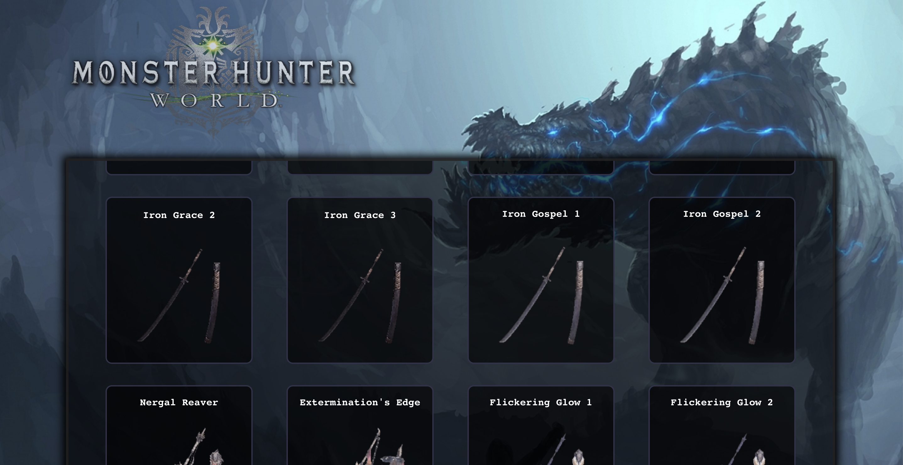
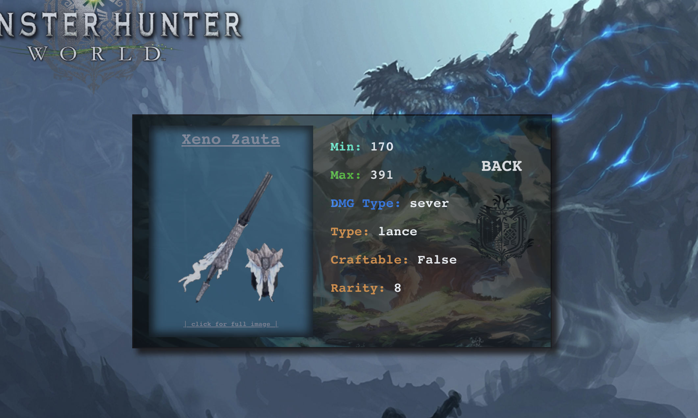
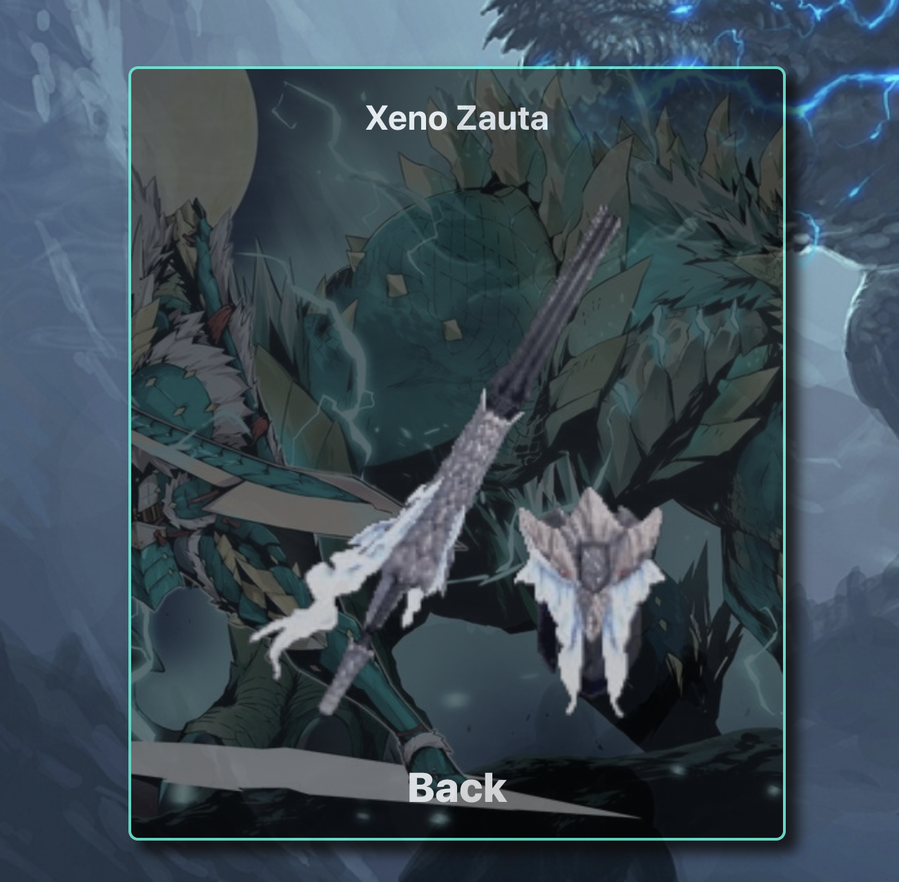

# MHW-Weapons

This app is an informational page designed to help current players find weapons they would like to know about. The user can choose from the current database of weapons available. They will be able to click an individual image and it will bring them to a detailed page about what the weapon's stats are. The user can also view the full image of the weapon with a simple click of the image. They will also be able to navigate foward and back using buttons provided.

# Installation

**This application will use a backend, to access, please [clone down this repo](git@github.com:Rosebud303/monster-hunter-weapon-search.git).**

**Clone** this repo https://github.com/Rosebud303/monster-hunter-weapon-search and move into it.

``` git clone git@github.com:Rosebud303/monster-hunter-weapon-search.git```

In the project directory you will need to instal dependencies and start the server, please run:

```npm install```

```npm start```


# Load Page


# Weapons Display



# Weapon Details



# Full Image




# Tech/Frameworks Used

* React
* Sass/Scss
* JSX
* fetch API
* Testing with Enzyme & Jest
* Router
* Thunks

# Learning Goals 

My learning goals were to get better at Redux and thunk testing. I have always struggled with testing ever since it was introduced to me. I feel like this project was good practice for testing both of those things. It also helped me understand how to use Router better as well. This app made me feel stronger about my css skills as well.
